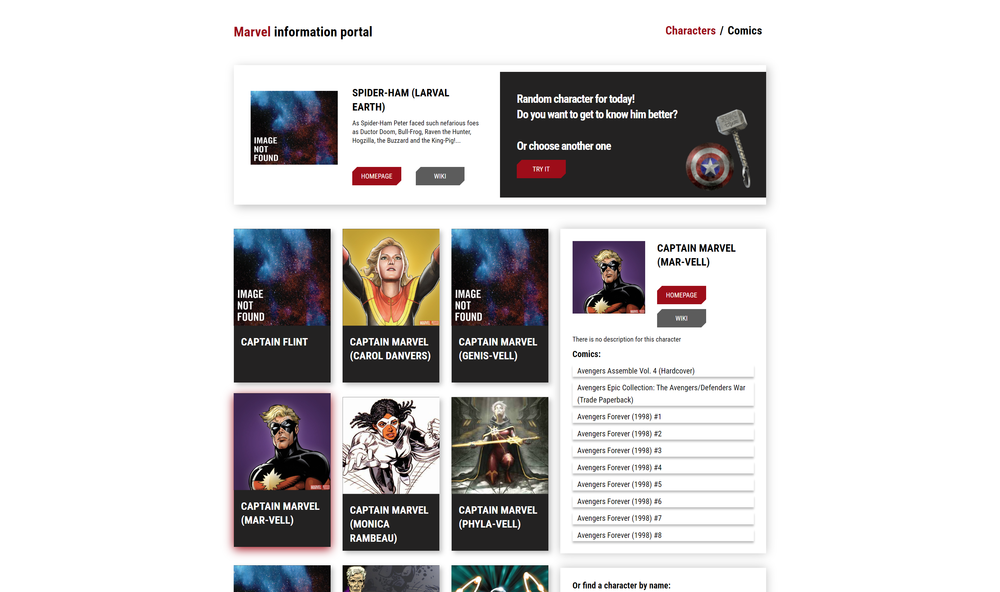

# MARVEL Information Portal

## Description

A test project which allows to get information about heroes from Marvel Comics Universe

### Features

- REST Queries
- Routing
- Pagination

### Dependencies

- Vite
- React + React Router + React Helmet
- Formik

### Installation

A start in the development mode:

    npx create-react-app my-app
    cd my-app
    npm install

### Execution

    npm start

Vite will start:

- frontend server on http://localhost:3000/

## Authors

@mirzaianov

## Version History

- 1.0.0 First Release